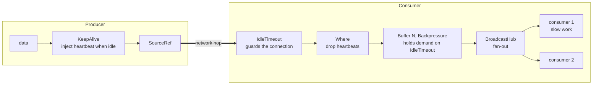
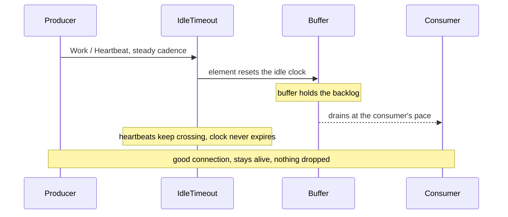
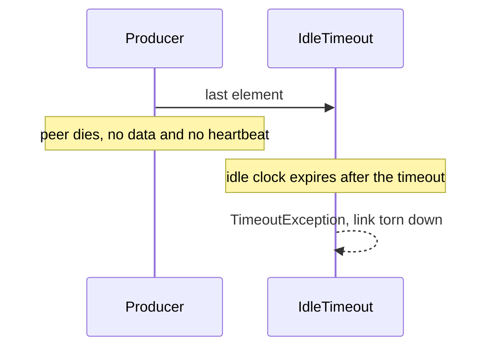

# Distributed backpressuring keep-alive

Tells a slow-but-alive consumer from a dead peer over a single link, without dropping work.

```
PRODUCER:  data -> KeepAlive -> SourceRef
CONSUMER:  SourceRef -> IdleTimeout -> Where(drop heartbeats) -> Buffer(N, Backpressure) -> BroadcastHub -> consumers
```

## How it works

The buffer disintermediates the consumer's demand. It holds demand on `IdleTimeout`, so the
producer's `KeepAlive` always has a slot to emit a heartbeat into, and `IdleTimeout` is sustained by
those heartbeats. `IdleTimeout` measures the connection, not the consumer's speed.

A slow consumer backpressures the work branch. It does not backpressure the heartbeats, because the
buffer keeps pulling them across `IdleTimeout` while the consumer works through its backlog. Nothing
is dropped: `Buffer(N, Backpressure)` backpressures the wire when it fills. `IdleTimeout` fires only
when the producer actually goes silent, and the slot is reclaimed.

Size `N` for the largest burst the hub has to absorb before the consumers catch up.



## Slow-but-alive stays up

Something crosses `IdleTimeout` on a steady cadence, real work or heartbeat, so its clock never
expires however far behind the consumer falls.



## Dead gets reclaimed

A dead peer sends nothing, heartbeats included. Nothing crosses `IdleTimeout`, its clock expires, the
stream fails, and the slot is reclaimed.



## Run it

```bash
dotnet run --project backpressure-sample
dotnet test backpressure-tests
```

Scenario 1 delivers every item even though the producer goes idle mid-stream. Scenario 2 reclaims a
silent peer.

```text
=== scenario 1: a slow, then idle, consumer stays alive and loses nothing ===
[consumer] Work { N = 1 }
[consumer] Work { N = 2 }
[consumer] Work { N = 3 }
[consumer] Work { N = 4 }
[producer] idle but alive (heartbeats only) for 4s...
[consumer] Work { N = 5 }
...
[consumer] Work { N = 20 }
[consumer] link ended: completed cleanly

=== scenario 2: a silent (dead) producer is reclaimed by IdleTimeout ===
[consumer] Work { N = 1 }
[producer] going silent (ungraceful death: no data, no heartbeat)...
[consumer] link ended: No elements passed in the last 00:00:02.
```

## Tests

[backpressure-tests](../backpressure-tests) proves the four cases end to end over a `SourceRef` and a
`BroadcastHub`:

- a transient backup is absorbed, with no false timeout and no loss
- an idle-but-alive producer stays up on heartbeats while the consumer is slow
- a silent producer is reclaimed by `IdleTimeout`
- a graceful completion completes cleanly
