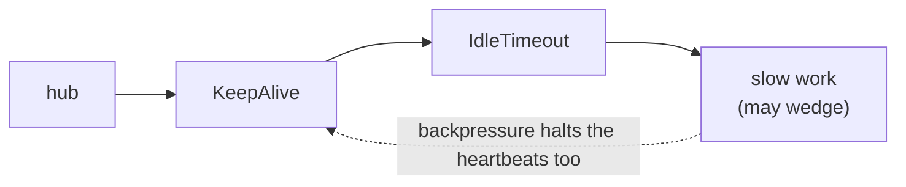
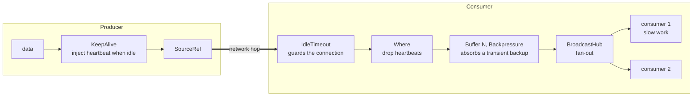
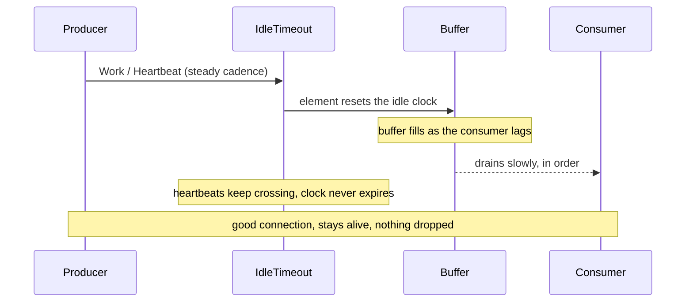
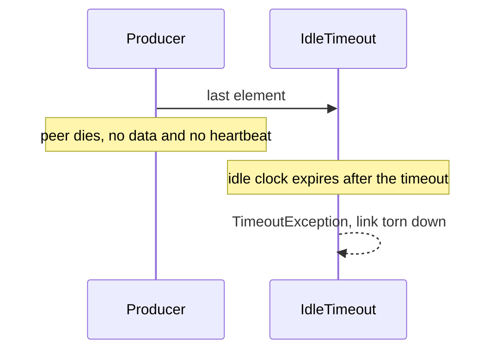

# Distributed backpressuring keep-alive

How the [`backpressure-sample`](../backpressure-sample/Program.cs) variant tells a **slow-but-alive**
consumer apart from a **dead** one, over a single in-band link, without ever dropping real work.

## The problem

A hub is fed by producers and read by consumers. Two failure modes must be told apart:

- **slow-but-alive** — a consumer whose work is backpressured but healthy. It must **not** be killed.
- **dead** — a peer that vanished with no clean shutdown. Its slot **must** be reclaimed.

The liveness signal is carried in-band: `KeepAlive` injects a heartbeat when the producer is idle,
and `IdleTimeout` on the far side declares the link dead after a period of silence.

## Why the naive shape false-fires

The simple sample ([`../Program.cs`](../Program.cs)) puts `KeepAlive` and `IdleTimeout` on the
consumer side, downstream of the slow work:



`KeepAlive` emission is **demand-gated** — a heartbeat is only pushed when there is downstream
demand. When the work backpressures, the heartbeats stop **and** `IdleTimeout` keeps counting, so a
live-but-slow peer is declared dead. Here the heartbeat measures *demand*, not *liveness*.

## The fix: decouple liveness from processing

Move `KeepAlive` to the producer side, and on the consumer side put a **backpressuring buffer**
between `IdleTimeout` and the hub. The buffer holds demand on `IdleTimeout` while the hub is
temporarily backed up, so heartbeats keep crossing no matter how slow the work is.



Three pieces do the work:

1. **`IdleTimeout` guards the connection only.** Its clock resets on *any* element that crosses it,
   real work or heartbeat.
2. **`Where` drops the heartbeats** right after they have reset the clock, so they never take a
   buffer slot or reach the hub.
3. **`Buffer(N, Backpressure)` absorbs a transient backup.** A `Buffer` keeps pulling upstream while
   it has room, so it keeps `IdleTimeout` fed while the hub is briefly wedged. It is
   **backpressuring, not dropping** — nothing is lost; when it fills, it backpressures the wire.

## Slow-but-alive stays up

While the producer is emitting (or idle but alive, sending only heartbeats), something crosses
`IdleTimeout` on a steady cadence, so its clock never expires — however slow or backed-up the
consumer is.



## Dead gets reclaimed

A dead peer sends nothing at all, heartbeats included. Nothing crosses `IdleTimeout`, its clock
expires, and the stream fails so the slot can be reclaimed.



## Sizing the buffer

`N` is the one load-bearing number. Size it to the worst **transient** backlog you expect while the
hub is briefly backed up: roughly `peak_inflow x longest_temporary_backup`. A transient backup that
drains before the buffer fills never reaches `IdleTimeout`. The buffer only *postpones* for an
**indefinite** stall, so pick a timeout comfortably above normal per-item processing time and pair
the in-band timeout with an out-of-band liveness signal (remote stream-ref / association death) for
the case where a peer is gone for good.

## Try it

```bash
# runnable demo: scenario 1 (slow, then idle, stays alive) then scenario 2 (silent peer reclaimed)
dotnet run --project backpressure-sample

# the end-to-end tests that prove all of the above
dotnet test backpressure-tests
```
